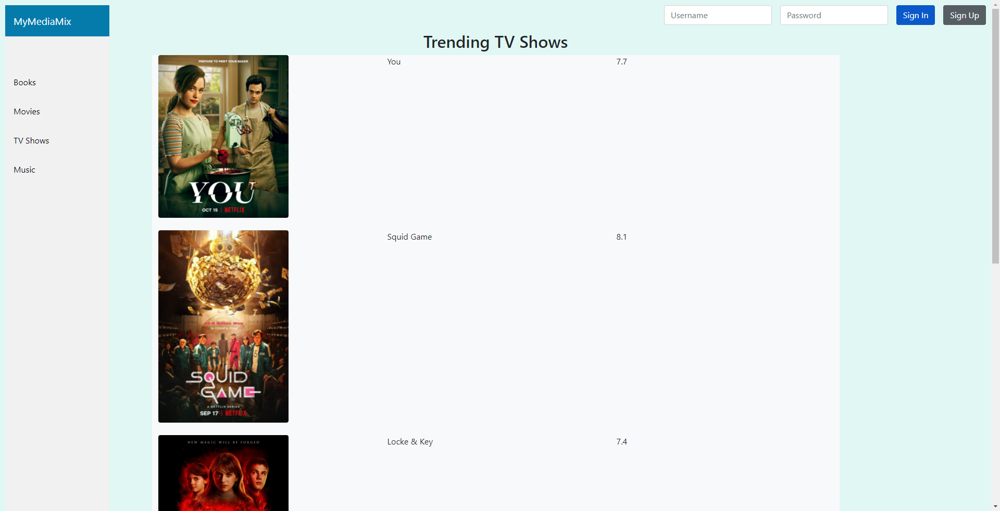
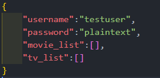

# Milestone 2

### Representation of API for application
As our focus is on a media tracking service, most of our API includes queries for media items, and then the ability to add or remove them from a particular user's list. We define two types of objects in our system:

- **Media Item**: Media items contain different field depending on their type. For now, we have TV shows and Movies which are input by the user. But, when database implementation occurs, we will have movies and TV shows taken from IMDB and added to a user's list to allow for a greater amount of data to be process. Currently, we have:
  - **Movies**: Title, User Rating
  - **TV Shows**: Title, User Rating

- **User Account**: User accounts will have three lists when finally created in the database. Currently, the application supports one list,
  - **Watched**: A list of media that a user has watched/read/listened to before.

 Our endpoints are as follows:

-   **/signup-page** This will simply route a user to the signup page in order to make a new account.

-   **\***  This is the wildcard route and it will tell a user that the specified page does not exist.
-   **/** This will route users to the landing page of the website (index.html).

-   **/register** Each user will be required to make an account (which will eventually occur within our database), and this will be used to store their tracked media list between sessions. This could be possible with cookies or sessions, but we want to ensure security of users' lists by using a database.

-   **/login** Similarly, users can login to their account to see their tracked media. Logging in is essential to keep persistence between visits and also security This will also be performed with a database.

-  **/add?{title=item}&media={Movie,TV}&rating={number}** When a user is specified (i.e. a user is logged in), they can use this endpoint to add a media item to their list. Additionally, they can add a rating if they choose to.

-  **/delete?{title=item}&media={Movie,TV}** When a user is specified (i.e. a user is logged in), they can use this endpoint to remove a media item from their list.

-  **/read** When a user is specified (i.e. a user is logged in), they can use this endpoint to be routed to the list.html page and thus view their list. This list will change dynamically as a user updates, deletes, or creates from their list (this can only occur when the database implementation occurs, otherwise we would have to store a user's list locally, which does not allow for correct persistence and security).

-  **/update?{title=item}&media={Movie,TV}&rating={number}** This endpoint will update the specified media item with the new specified rated indicated in the query string. This will replace all instances in the list with the title to the new rating specified in the query string.

### Client Interface with descriptions

### Listing Most Popular 5 movies on IMDB currently (Read)

Above, we see the results of clicking on trending movies on the landing page, which shows the top 250 most popular movies on IMDB.

### Listing Most Popular 5 TV shows on IMDB currently (Read)

Above, we see the results of clicking on trending Tv Shows on the landing page, which shows the top 250 most popular TV shows on IMDB.

### Adding a movie to movie list (Create)

Here, we see the addition of a movie/tv show to a user's list.

### Listing Most Popular 5 TV shows on IMDB currently (Update)

Here, we see the updating of a rating (relative to last picture) of a movie/tv show to a user's list.

### Listing Most Popular 5 TV shows on IMDB currently (Delete)

Here, we see the deletion of a movie/tv show from a user's list.

### Heroku URL
https://mymediamix.herokuapp.com

### Divison of Labor
Jarred: Handled the server.js routing and setting up the IMDB api (which is limited to 100 calls per day).

Bill: Linked pages together and updated old html/javascript.

Thao: Handled Heroku deployment and updating CSS and HTML.
